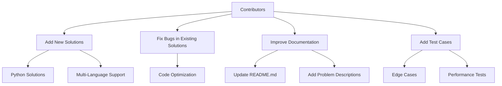

# LeetCode Python Solutions

This repository contains Python solutions for various LeetCode problems. Each problem is organized in its own directory under the `Solution/` folder, with a `readme.md` file providing the problem description, examples, constraints, and solutions in multiple programming languages.

## 🚀 Features

- **Comprehensive Solutions**: Includes Python solutions for a wide range of LeetCode problems.
- **Multi-Language Support**: Problem descriptions and solutions are available in multiple programming languages.
- **Organized Structure**: Each problem is neatly organized in its own directory with a dedicated `readme.md` file.
- **Interactive and Informative**: Easy-to-navigate structure with detailed explanations and examples.

## 📂 Repository Structure

## 🛠️ How to Use

1. Navigate to the `Solution/` folder.
2. Find the directory corresponding to the problem you are interested in (e.g., `104. Maximum Depth of Binary Tree`).
3. Open the `readme.md` file for the problem description, examples, and solutions.
4. Review the Python solution in the `.py` file.

## 🌟 Highlights

- **Beginner-Friendly**: Solutions are written in a clear and concise manner, making them easy to understand.
- **Advanced Techniques**: Includes optimized solutions for complex problems.
- **Regular Updates**: The repository is continuously updated with new problems and solutions.

## 🤝 Contributing

Contributions are welcome! If you have a better solution or additional test cases, feel free to submit a pull request.

### Steps to Contribute

1. Fork the repository.
2. Create a new branch for your changes.
3. Add your solution or update an existing one.
4. Commit your changes with a descriptive message.
5. Submit a pull request.

### Contribution Graph

## 📜 License

This repository is licensed under the MIT License. See the `LICENSE` file for more details.

---

## 📊 Statistics

- **Total Problems Solved**: 100+ (and counting!)
- **Languages Supported**: Python, Java, C++, Go, TypeScript
- **Difficulty Levels**: Easy, Medium, Hard

---

## 📌 Quick Links

- [LeetCode Website](https://leetcode.com/)
- [Contribute to this Repo](https://github.com/your-repo-link)
- [MIT License](LICENSE)

---

