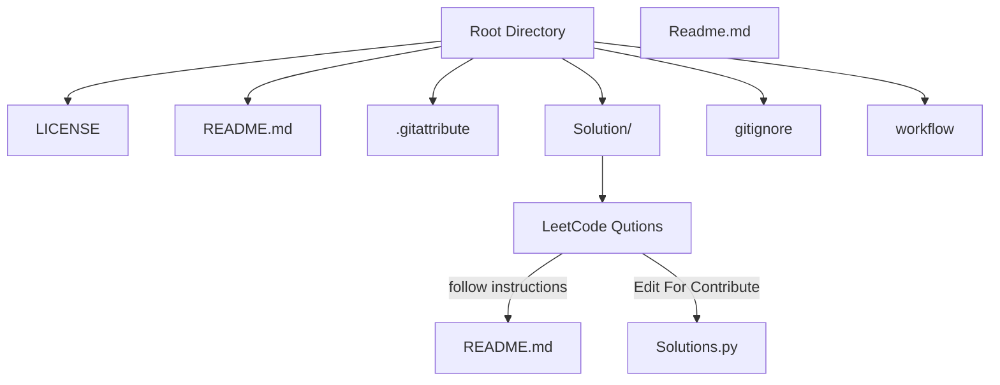
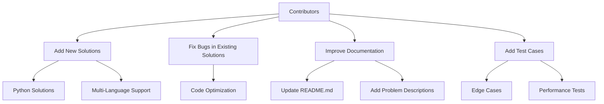
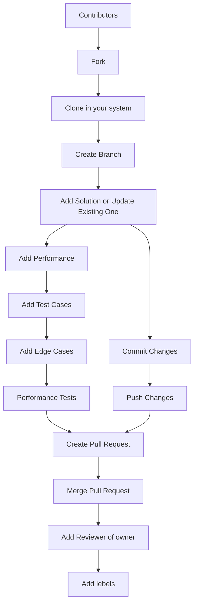

# LeetCode Python Solutions

This repository contains Python solutions for various LeetCode problems. Each problem is organized in its own directory under the `Solution/` folder, with a `readme.md` file providing the problem description, examples, constraints, and solutions in multiple programming languages.

## 🚀 Features

- **Comprehensive Solutions**: Includes Python solutions for a wide range of LeetCode problems.
- **Multi-Language Support**: Problem descriptions and solutions are available in multiple programming languages.
- **Organized Structure**: Each problem is neatly organized in its own directory with a dedicated `readme.md` file.
- **Interactive and Informative**: Easy-to-navigate structure with detailed explanations and examples.

## 📂 Repository Structure

## 🛠️ How to Use

1. Navigate to the `Solution/` folder.
2. Find the directory corresponding to the problem you are interested in (e.g., `104. Maximum Depth of Binary Tree`).
3. Open the `readme.md` file for the problem description, examples, and solutions.
4. Review the Python solution in the `.py` file.

## 🌟 Highlights

- **Beginner-Friendly**: Solutions are written in a clear and concise manner, making them easy to understand.
- **Advanced Techniques**: Includes optimized solutions for complex problems.
- **Regular Updates**: The repository is continuously updated with new problems and solutions.

## 🤝 Contributing

Contributions are welcome! If you have a better solution or additional test cases, feel free to submit a pull request.

### Steps to Contribute

1. Fork the repository.
2. Create a new branch for your changes.
3. Add your solution or update an existing one.
4. Commit your changes with a descriptive message.
5. Submit a pull request.

### Contribution Graph

### Contribution Graph

## 📜 License

This repository is licensed under the MIT License. See the `LICENSE` file for more details.

---

## 📊 Statistics

- **Total Problems Solved**: 100+ (and counting!)
- **Languages Supported**: Python, Java, C++, Go, TypeScript
- **Difficulty Levels**: Easy, Medium, Hard

---

## 📌 Quick Links

- [LeetCode Website](https://leetcode.com/)
- [Contribute to this Repo](https://github.com/your-repo-link)
- [MIT License](LICENSE)

---

## Index of LeetCode Python Solutions

This index provides a quick overview of all the problems and solutions available in this repository. Each problem is organized under the `Solution/` folder, and older solutions are stored in the `privious/` folder.

## 📂 Solution Directory

### Problems by ID

- **1004. Max Consecutive Ones III**
- **104. Maximum Depth of Binary Tree**
- **11. Container With Most Water**
- **1161. Maximum Level Sum of a Binary Tree**
- **1207. Unique Number of Occurrences**
- **1372. Longest ZigZag Path in a Binary Tree**
- **1448. Count Good Nodes in Binary Tree**
- **1456. Maximum Number of Vowels in a Substring of Given Length**
- **1466. Reorder Routes to Make All Paths Lead to the City Zero**
- **1493. Longest Subarray of 1's After Deleting One Element**
- **151. Reverse Words in a String**
- **1657. Determine if Two Strings Are Close**
- **1679. Max Number of K-Sum Pairs**
- **1732. Find the Highest Altitude**
- **1926. Nearest Exit from Entrance in Maze**
- **199. Binary Tree Right Side View**
- **206. Reverse Linked List**
- **2095. Delete the Middle Node of a Linked List**
- **2130. Maximum Twin Sum of a Linked List**
- **215. Kth Largest Element in an Array**
- **2215. Find the Difference of Two Arrays**
- **2336. Smallest Number in Infinite Set**
- **2352. Equal Row and Column Pairs**
- **236. Lowest Common Ancestor of a Binary Tree**
- **238. Product of Array Except Self**
- **2390. Removing Stars From a String**
- **2462. Total Cost to Hire K Workers**
- **2542. Maximum Subsequence Score**
- **283. Move Zeroes**
- **328. Odd Even Linked List**
- **334. Increasing Triplet Subsequence**
- **345. Reverse Vowels of a String**
- **374. Guess Number Higher or Lower**
- **392. Is Subsequence**
- **394. Decode String**
- **399. Evaluate Division**
- **437. Path Sum III**
- **443. String Compression**
- **450. Delete Node in a BST**
- **547. Number of Provinces**
- **643. Maximum Average Subarray I**
- **649. Dota2 Senate**
- **700. Search in a Binary Search Tree**
- **724. Find Pivot Index**
- **735. Asteroid Collision**
- **841. Keys and Rooms**

## 📂 Previous Solutions Directory

### Problems by ID

- **2115. Find All Possible Recipes from Given Supplies**
- **2206. Divide Array Into Equal Pairs**
- **2226. Maximum Candies Allocated to K Children**
- **2560. House Robber IV**
- **2594. Minimum Time to Repair Cars**
- **3356. Zero Array Transformation II**

