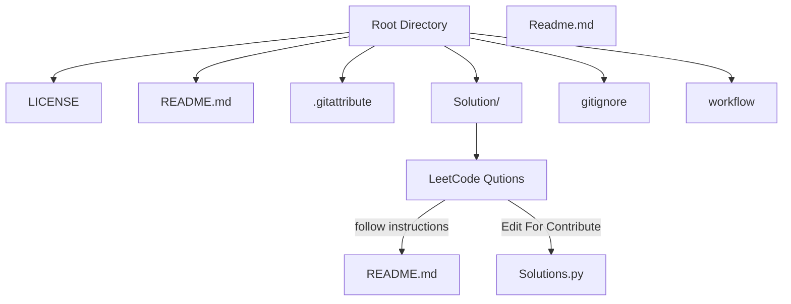
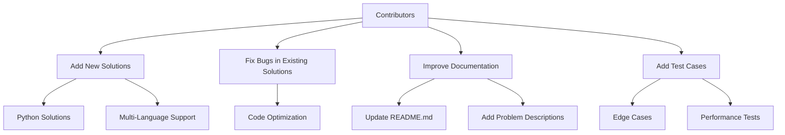
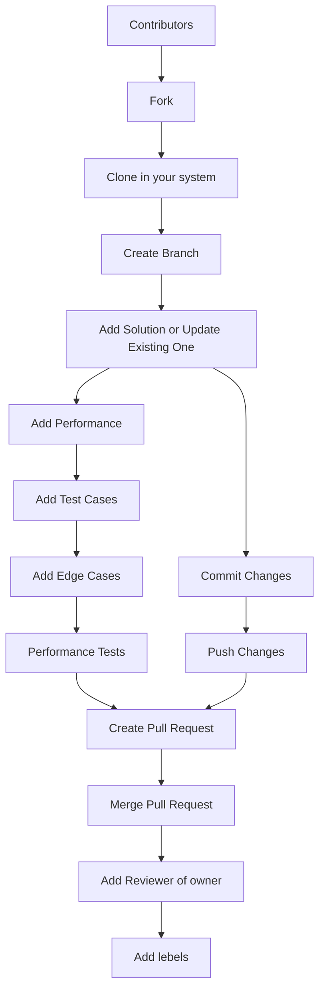

# LeetCode Python Solutions

<!-- 

 -->

This repository contains Python solutions for various LeetCode problems. Each problem is organized in its own directory under the `Solution/` folder, with a `readme.md` file providing the problem description, examples, constraints, and solutions in multiple programming languages.

## 🌟 Why Use This Repository?

#### **"Success is the sum of small efforts, repeated day in and day out."** — Robert Collier

This repository is designed to help you:

- **Master Problem-Solving**: Tackle a wide range of LeetCode problems with clear and concise solutions.
- **Learn Efficiently**: Understand optimized approaches and advanced techniques.
- **Stay Motivated**: Progress step by step, and see your skills grow with every solved problem.
- **Collaborate and Contribute**: Join a community of learners and developers to share knowledge and improve together.

Whether you're preparing for coding interviews, enhancing your algorithmic skills, or just exploring the joy of problem-solving, this repository is your companion on the journey to success.

---

## 📑 Table of Contents

- [🚀 Features](#-features)
- [📂 Repository Structure](#-repository-structure)
- [🛠️ How to Use](#️-how-to-use)
- [🌟 Highlights](#-highlights)
- [🤝 Contributing](#-contributing)
  - [Steps to Contribute](#steps-to-contribute)
  - [Contribution Graph](#contribution-graph)
- [📜 License](#-license)
- [📊 Statistics](#-statistics)
- [📌 Quick Links](#-quick-links)
- [Index of LeetCode Python Solutions](#index-of-leetcode-python-solutions)

## 🚀 Features

- **Comprehensive Solutions**: Includes Python solutions for a wide range of LeetCode problems.
- **Multi-Language Support**: Problem descriptions and solutions are available in multiple programming languages.
- **Organized Structure**: Each problem is neatly organized in its own directory with a dedicated `readme.md` file.
- **Interactive and Informative**: Easy-to-navigate structure with detailed explanations and examples.

## 📂 Repository Structure

## 🛠️ How to Use

1. Navigate to the `Solution/` folder.
2. Find the directory corresponding to the problem you are interested in (e.g., `104. Maximum Depth of Binary Tree`).
3. Open the `readme.md` file for the problem description, examples, and solutions.
4. Review the Python solution in the `.py` file.

## 🌟 Highlights

- **Beginner-Friendly**: Solutions are written in a clear and concise manner, making them easy to understand.
- **Advanced Techniques**: Includes optimized solutions for complex problems.
- **Regular Updates**: The repository is continuously updated with new problems and solutions.

## 🤝 Contributing

Contributions are welcome! If you have a better solution or additional test cases, feel free to submit a pull request.

### Steps to Contribute

1. Fork the repository.
2. Create a new branch for your changes.
3. Add your solution or update an existing one.
4. Commit your changes with a descriptive message.
5. Submit a pull request.

### Contribution Graph

### Contribution Graph

## 📜 License

This repository is licensed under the MIT License. See the `LICENSE` file for more details.

---

## 📊 Statistics

- **Total Problems Solved**: 100+ (and counting!)
- **Languages Supported**: Python, Java, C++, Go, TypeScript
- **Difficulty Levels**: Easy, Medium, Hard

---

## 📌 Quick Links

- [LeetCode Website](https://leetcode.com/)
- [Contribute to this Repo](https://github.com/your-repo-link)
- [MIT License](LICENSE)

---

## Index of LeetCode Python Solutions

This index provides a quick overview of all the problems and solutions available in this repository. Each problem is organized under the `Solution/` folder, and older solutions are stored in the `privious/` folder.

## 📂 Solution Directory

### Problems by ID

- [**1004. Max Consecutive Ones III**](Solution/1004.%20Max%20Consecutive%20Ones%20III/readme.md)
- [**104. Maximum Depth of Binary Tree**](Solution/104.%20Maximum%20Depth%20of%20Binary%20Tree/readme.md)
- [**1071. Greatest Common Divisor of Strings**](Solution/1071.%20Greatest%20Common%20Divisor%20of%20Strings/readme.md)
- [**11. Container With Most Water**](Solution/11.%20Container%20With%20Most%20Water/readme.md)
- [**1137. N-th Tribonacci Number**](Solution/1137.%20N-th%20Tribonacci%20Number/readme.md)
- [**1143. Longest Common Subsequence**](Solution/1143.%20Longest%20Common%20Subsequence/readme.md)
- [**1161. Maximum Level Sum of a Binary Tree**](Solution/1161.%20Maximum%20Level%20Sum%20of%20a%20Binary%20Tree/readme.md)
- [**1207. Unique Number of Occurrences**](Solution/1207.%20Unique%20Number%20of%20Occurrences/readme.md)
- [**1268. Search Suggestions System**](Solution/1268.%20Search%20Suggestions%20System/readme.md)
- [**1318. Minimum Flips to Make a OR b Equal to c**](Solution/1318.%20Minimum%20Flips%20to%20Make%20a%20OR%20b%20Equal%20to%20c/readme.md)
- [**136. Single Number**](Solution/136.%20Single%20Number/readme.md)
- [**1372. Longest ZigZag Path in a Binary Tree**](Solution/1372.%20Longest%20ZigZag%20Path%20in%20a%20Binary%20Tree/readme.md)
- [**1431. Kids With the Greatest Number of Candies**](Solution/1431.%20Kids%20With%20the%20Greatest%20Number%20of%20Candies/readme.md)
- [**1448. Count Good Nodes in Binary Tree**](Solution/1448.%20Count%20Good%20Nodes%20in%20Binary%20Tree/readme.md)
- [**1456. Maximum Number of Vowels in a Substring of Given Length**](Solution/1456.%20Maximum%20Number%20of%20Vowels%20in%20a%20Substring%20of%20Given%20Length/readme.md)
- [**1466. Reorder Routes to Make All Paths Lead to the City Zero**](Solution/1466.%20Reorder%20Routes%20to%20Make%20All%20Paths%20Lead%20to%20the%20City%20Zero/readme.md)
- [**1493. Longest Subarray of 1's After Deleting One Element**](Solution/1493.%20Longest%20Subarray%20of%201's%20After%20Deleting%20One%20Element/readme.md)
- [**151. Reverse Words in a String**](Solution/151.%20Reverse%20Words%20in%20a%20String/readme.md)
- [**162. Find Peak Element**](Solution/162.%20Find%20Peak%20Element/readme.md)
- [**1657. Determine if Two Strings Are Close**](Solution/1657.%20Determine%20if%20Two%20Strings%20Are%20Close/readme.md)
- [**1679. Max Number of K-Sum Pairs**](Solution/1679.%20Max%20Number%20of%20K-Sum%20Pairs/readme.md)
- [**17. Letter Combinations of a Phone Number**](Solution/17.%20Letter%20Combinations%20of%20a%20Phone%20Number/readme.md)
- [**1732. Find the Highest Altitude**](Solution/1732.%20Find%20the%20Highest%20Altitude/readme.md)
- [**1768. Merge Strings Alternately**](Solution/1768.%20Merge%20Strings%20Alternately/readme.md)
- [**1926. Nearest Exit from Entrance in Maze**](Solution/1926.%20Nearest%20Exit%20from%20Entrance%20in%20Maze/readme.md)
- [**198. House Robber**](Solution/198.%20House%20Robber/readme.md)
- [**199. Binary Tree Right Side View**](Solution/199.%20Binary%20Tree%20Right%20Side%20View/readme.md)
- [**206. Reverse Linked List**](Solution/206.%20Reverse%20Linked%20List/readme.md)
- [**208. Implement Trie (Prefix Tree)**](Solution/208.%20Implement%20Trie%20(Prefix%20Tree)/readme.md)
- [**2095. Delete the Middle Node of a Linked List**](Solution/2095.%20Delete%20the%20Middle%20Node%20of%20a%20Linked%20List/readme.md)
- [**2130. Maximum Twin Sum of a Linked List**](Solution/2130.%20Maximum%20Twin%20Sum%20of%20a%20Linked%20List/readme.md)
- [**215. Kth Largest Element in an Array**](Solution/215.%20Kth%20Largest%20Element%20in%20an%20Array/readme.md)
- [**216. Combination Sum III**](Solution/216.%20Combination%20Sum%20III/readme.md)
- [**2215. Find the Difference of Two Arrays**](Solution/2215.%20Find%20the%20Difference%20of%20Two%20Arrays/readme.md)
- [**2300. Successful Pairs of Spells and Potions**](Solution/2300.%20Successful%20Pairs%20of%20Spells%20and%20Potions/readme.md)
- [**2336. Smallest Number in Infinite Set**](Solution/2336.%20Smallest%20Number%20in%20Infinite%20Set/readme.md)
- [**2352. Equal Row and Column Pairs**](Solution/2352.%20Equal%20Row%20and%20Column%20Pairs/readme.md)
- [**236. Lowest Common Ancestor of a Binary Tree**](Solution/236.%20Lowest%20Common%20Ancestor%20of%20a%20Binary%20Tree/readme.md)
- [**238. Product of Array Except Self**](Solution/238.%20Product%20of%20Array%20Except%20Self/readme.md)
- [**2390. Removing Stars From a String**](Solution/2390.%20Removing%20Stars%20From%20a%20String/readme.md)
- [**2462. Total Cost to Hire K Workers**](Solution/2462.%20Total%20Cost%20to%20Hire%20K%20Workers/readme.md)

## 📂 Previous Solutions Directory

### Problems by ID

- [**2115. Find All Possible Recipes from Given Supplies**](privious/2115.%20Find%20All%20Possible%20Recipes%20from%20Given%20Supplies.py)
- [**2206. Divide Array Into Equal Pairs**](privious/2206.%20Divide%20Array%20Into%20Equal%20Pairs.py)
- [**2226. Maximum Candies Allocated to K Children**](privious/2226.%20Maximum%20Candies%20Allocated%20to%20K%20Children.py)
- [**2560. House Robber IV**](privious/2560.%20House%20Robber%20IV.py)
- [**2594. Minimum Time to Repair Cars**](privious/2594.%20Minimum%20Time%20to%20Repair%20Cars.py)
- [**3356. Zero Array Transformation II**](privious/3356.%20Zero%20Array%20Transformation%20II.py)

---

For detailed problem descriptions and solutions, navigate to the respective directories.

